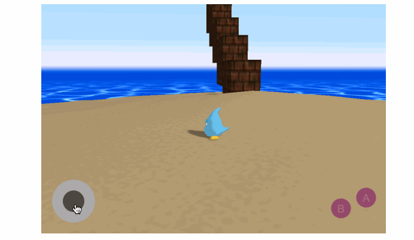

# Zenpad.js — GamePad for canvas game.



[](https://app.wercker.com/project/byKey/6764b7988a279822959e792434e70223)
[](LICENSE)

The aim of the project is to create an easy to use gamepad library for `<canvas>`.

### Demo

- [http://zendash.sawa-zen.com/](http://zendash.sawa-zen.com/)
- [http://zenpad.sawa-zen.com/demo/](http://zenpad.sawa-zen.com/demo/)

### Usage

Prepare DOM for Zenpad.js.

```html
<div id="myZenpad"></div>
```

#### Install from script

```html
<script src="zenpad.js"></script>
<script>
var zenpad = new Zenpad('myZenpad');
// ... see below
</script>
```

#### Install from require

```javascript
var Zenpad = require('zenpad.js');
var zenpad = new Zenpad('myZenpad');
// ... see below
```

#### General

```javascript
zenpad.on('touchstartA', function() {
  console.info('touchstartA');
});

zenpad.on('moveStick', function(event) {
  console.info('moveStick', event.x);
});
```

### Method

- **on(eventName:String, handler:Function)**

  Use to add events.

- **off(eventName:String, handler:Function)**

  Use to remove events.

- **dispose()**

  Use to dispose zenpad.

### Event

- **touchstartA**

  Emit "touchstartA" event when push "A" button.

- **touchendA**

  Emit "touchendA" event when pull "A" button.

- **clickA**

  This is "touchendA" alias event.

- **touchstartB**

  Emit "touchstartB" event when push "B" button.

- **touchendB**

  Emit "touchendB" event when pull "B" button.

- **clickB**

  This is "touchendB" alias event.

- **moveStick**

  Emit "moveStick" event when move stick.

  **Property**
  - **x** : It is "x" position of stick.
  - **y** : It is "y" position of stick.
  - **angle** : It is the angle where the stick was knocked down.
  - **length** : It is the distance between the stick and the center.


- **releaseStick**

  Emit "releaseStick" event when stick is released.
